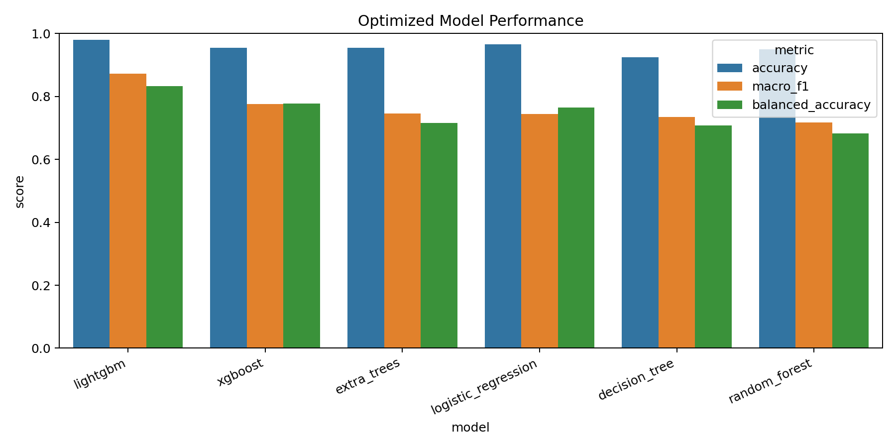
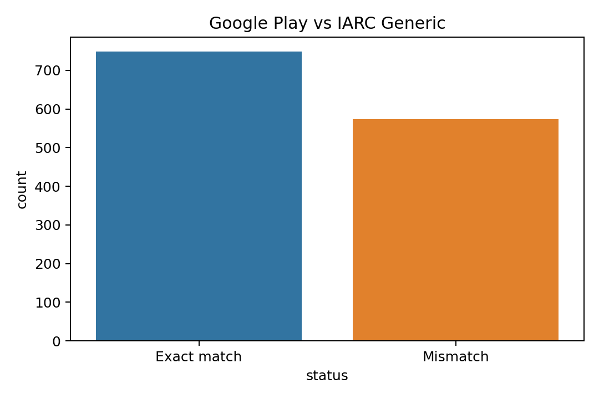

# Black-Box Reverse Modeling and Prediction of Google Play Age Ratings

## Abstract

Google Play uses the IARC content rating questionnaire to generate age ratings, content descriptors, and interactive element labels for applications. However, the detailed decision logic behind the questionnaire is not publicly disclosed, so the rating process can be treated as a black-box system from the perspective of developers and users.

This experiment builds a data-driven surrogate model for this black box. By automatically exploring questionnaire paths, collecting real questionnaire-response samples, extracting structured features, and training multi-class classifiers, the project predicts the final age rating from questionnaire answers. The final dataset contains 1,322 valid and deduplicated real samples. The best optimized model, LightGBM, achieves 0.980 accuracy, 0.872 macro-F1, and 0.010 severe error rate on the holdout test set.

The main findings are threefold. First, questionnaire answers are sufficient to approximate the rating mechanism with strong predictive performance. Second, result-page descriptors and interactive elements provide additional useful signals, but answer-only prediction is still analyzed separately to avoid overstating pre-submission prediction ability. Third, the remaining difficulty mainly comes from class imbalance, especially the limited number of `3+`, `7+`, and `16+` samples.

## 1. Introduction

Age ratings help users and parents understand whether an application is suitable for minors. In Google Play, these ratings are generated after developers complete a content rating questionnaire. The questionnaire contains many conditional branches: later questions depend on earlier answers, and the final result is produced only after the whole questionnaire is submitted.

The goal of this project is to reverse model this rating mechanism as a black-box prediction task:

- Input: answers selected in the Google Play / IARC content rating questionnaire.
- Output: the final IARC Generic age rating.
- Label space: `3+`, `7+`, `12+`, `16+`, and `18+`.

The project includes data collection, dataset construction, feature engineering, model training, optimization, result analysis, and black-box interpretation.

The contributions of this experiment are:

- A real automated data collection pipeline for a tree-structured questionnaire.
- A deduplicated dataset of 1,322 valid questionnaire-result samples.
- A feature engineering pipeline that converts conditional questionnaire paths into model-ready features.
- A comparison of multiple baseline and machine-learning models.
- Optimization, ablation, cross-validation, error analysis, and feature-importance analysis.

## 2. Data Collection Strategy

### 2.1 Collection Method

The questionnaire was collected through an automated browser workflow based on Chrome DevTools Protocol (CDP) and Playwright. Instead of manually submitting the questionnaire, the script connected to a logged-in Chrome instance, selected answers, submitted the form, parsed the result page, and stored each completed sample.

The main collection strategy was randomized path exploration. For each questionnaire run, the collector selected one available option for each visible question, followed the conditional questionnaire tree until the final save/submit state, and then parsed the returned rating result.

The collection workflow used the following mechanisms:

- Randomized exploration of tree-structured questionnaire paths.
- Incremental JSONL persistence after each completed sample.
- Resume support with seed offset to avoid replaying old paths.
- CDP reconnection after browser or tab failures.
- Deduplication by `response_signature`, a hash of the answer combination.
- Minority-class oriented supplement sampling to collect more low- and medium-risk samples.

### 2.2 Key Collection Scripts

| File | Function |
|---|---|
| `scripts/probe_questionnaire_branches.py` | Probe questionnaire structure and branches. |
| `scripts/probe_questionnaire_branches_cdp.py` | Connect to Chrome through CDP. |
| `scripts/sample_questionnaire_paths_cdp.py` | Collect randomized questionnaire paths and parse rating results. |
| `scripts/sample_minority_paths_cdp.py` | Supplement minority classes with low/medium-risk sampling. |
| `scripts/convert_cdp_samples.py` | Convert CDP outputs into the standard training JSONL format. |
| `scripts/validate_dataset.py` | Validate sample completeness and label availability. |
| `scripts/build_dataset.py` | Build processed dataset and feature matrix. |

### 2.3 Core Collection Logic

The following simplified pseudocode shows the core idea of the collector:

```python
for i in range(sample_count):
    page = connect_to_logged_in_chrome_via_cdp()
    answers = {}

    while questionnaire_can_continue(page):
        visible_questions = parse_visible_questions(page)
        question = choose_next_unanswered_question(visible_questions)
        option = random_choice(question.options)
        select_option(page, question, option)
        answers[question.id] = option
        click_next_or_save(page)

    rating_result = parse_rating_summary(page)
    signature = hash_answer_combination(answers)

    if signature not in seen_signatures:
        append_jsonl({
            "responses": answers,
            "response_signature": signature,
            "rating_result": rating_result,
            "status": "success"
        })
```

This approach treats the questionnaire as an unknown decision tree and samples valid paths from it, while avoiding repeated answer combinations.

## 3. Dataset Construction and Analysis

### 3.1 Dataset Files

The final dataset files are:

| File | Description |
|---|---|
| `data/raw/real_20260615_full.samples.jsonl` | Final raw real questionnaire samples. |
| `data/processed/real_20260615_full.dataset.csv` | Processed dataset with labels. |
| `data/processed/real_20260615_full.features.csv` | Feature matrix for modeling. |
| `outputs/analysis/current/metrics/dataset_validation_full.json` | Dataset validation report. |

### 3.2 Dataset Statistics

The final dataset contains 1,322 valid samples.

| Metric | Value |
|---|---:|
| Input records before final filtering | 1,341 |
| Completed records | 1,339 |
| Loop-detected records | 2 |
| Duplicate signatures skipped | 17 |
| Valid deduplicated samples | 1,322 |
| Invalid samples | 0 |
| Missing labels | 0 |
| Unique answer combinations | 1,322 |
| Number of discovered questions | 229 |

The main label is `result_age_rating` under the IARC Generic authority.

### 3.3 Label Distribution

| Age Rating | Count | Percentage |
|---|---:|---:|
| `3+` | 37 | 2.8% |
| `7+` | 19 | 1.4% |
| `12+` | 225 | 17.0% |
| `16+` | 28 | 2.1% |
| `18+` | 1,013 | 76.6% |


The dataset is highly imbalanced. The `18+` class dominates the data, while `3+`, `7+`, and `16+` are minority classes. Therefore, accuracy alone is not sufficient for evaluation; macro-F1, balanced accuracy, and severe error rate are also reported.

This imbalance is not only a modeling problem but also a property of the collection process. Randomly sampled paths often include at least one high-risk answer, which easily pushes the final rating toward `18+`. Minority-oriented supplement sampling was therefore used to increase the number of low- and medium-risk samples, but the final dataset still reflects the fact that low-rating paths are harder to discover.

## 4. Feature Engineering

Each raw sample stores the full questionnaire answer dictionary. During preprocessing, answers were transformed into machine-learning features.

### 4.1 Answer Features

Questionnaire answers were expanded into one-hot binary features:

```text
answer__question_id_option = 0 or 1
```

This representation preserves the detailed questionnaire path and selected options.

### 4.2 Statistical and Derived Features

In addition to answer-level one-hot features, the pipeline generated aggregate features:

| Feature | Meaning |
|---|---|
| `visible_question_count` | Number of questions displayed in a path. |
| `skipped_question_count` | Number of skipped or invisible branch questions. |
| `content_descriptor_count` | Number of content descriptors in the result. |
| `interactive_element_count` | Number of interactive elements in the result. |
| `violence_score`, `sexual_content_score`, `language_score`, etc. | Domain-specific risk counters. |
| `high_risk_count`, `medium_risk_count` | Aggregate risk indicators. |
| `triggered_branch_count` | Number of triggered questionnaire branches. |

The final feature matrix has the following size:

```text
X shape = 1322 x 1010
features.csv shape = 1322 x 1011
```

The extra column in `features.csv` is the target label.

### 4.3 Feature Scope and Leakage Control

The project distinguishes two prediction settings:

| Setting | Feature Scope | Purpose |
|---|---|---|
| Full-feature analysis | Questionnaire answers plus parsed descriptor and interactive-element counts | Best surrogate modeling and mechanism analysis. |
| Answer-only prediction | Questionnaire answers only | Closer to a pre-submission prediction scenario. |

This distinction is important because `content_descriptor_count` and `interactive_element_count` are parsed from the rating result page. They are useful for understanding the structure of the rating output, but they should not be treated as information available before submitting the questionnaire. For this reason, the ablation study reports both the full model and the answer-only model.

### 4.4 Data Processing Detail

One important preprocessing issue was the treatment of the string `"None"`. Some questionnaire options use `"None"` as a valid answer. However, pandas may interpret `"None"` as a missing value by default. The project fixed this by reading CSV files as follows:

```python
pd.read_csv(path, keep_default_na=False, na_values=[""])
```

This keeps `"None"` as a valid category while still treating empty cells as missing values.

## 5. Model Training and Evaluation

### 5.1 Train-Test Split

The dataset was split into training and holdout test sets:

| Setting | Value |
|---|---|
| Random seed | 42 |
| Test size | 0.15 |
| Train size | 1,123 |
| Test size | 199 |

Holdout test label support:

| Age Rating | Test Samples |
|---|---:|
| `3+` | 6 |
| `7+` | 3 |
| `12+` | 34 |
| `16+` | 4 |
| `18+` | 152 |

Because the minority classes have very small support in the holdout set, their per-class metrics should be interpreted carefully.

### 5.2 Models

The experiment trained more than the required three models:

- Majority baseline
- Stratified random baseline
- Logistic Regression
- Decision Tree
- Random Forest
- Extra Trees
- XGBoost
- LightGBM

### 5.3 Evaluation Metrics

The following metrics were used:

| Metric | Purpose |
|---|---|
| Accuracy | Overall correctness. |
| Macro-F1 | Average F1 across classes, treating minority classes equally. |
| Balanced accuracy | Average recall across classes. |
| Weighted-F1 | F1 weighted by class support. |
| Mean absolute age error | Average distance between predicted and true rating levels. |
| Severe error rate | Fraction of predictions with age-level distance at least 2. |

The ordinal mapping used for age-level error is:

```text
3+ -> 0
7+ -> 1
12+ -> 2
16+ -> 3
18+ -> 4
```

### 5.4 Core Training Logic

The model training pipeline follows the same structure for all classifiers: load validated samples, build features, split the dataset, train each model, evaluate it, and save metrics and artifacts.

```python
samples = load_jsonl("data/raw/real_20260615_full.samples.jsonl")
valid_samples = validate_samples(samples)

X, y = build_feature_matrix(
    valid_samples,
    label_field="result_age_rating"
)

X_train, X_test, y_train, y_test = train_test_split(
    X,
    y,
    test_size=0.15,
    random_state=42,
    stratify=y
)

model = LGBMClassifier(
    learning_rate=0.05,
    max_depth=5,
    num_leaves=15,
    min_child_samples=10,
    subsample=0.9,
    random_state=42
)

model.fit(X_train, y_train)
pred = model.predict(X_test)
metrics = evaluate_multiclass_rating(y_test, pred)
save_metrics(metrics, "outputs/analysis/current/metrics/")
```

The actual implementation also includes baseline models, optional models such as XGBoost and LightGBM, hyperparameter search, feature ablation, and artifact persistence.

## 6. Baseline Model Comparison

The first-stage model comparison was produced by `scripts/train_models.py`, with metrics saved in `outputs/analysis/current/metrics/model_metrics.json`.

| Model | Accuracy | Macro-F1 | Balanced Acc | Weighted-F1 | MAE | Severe Error |
|---|---:|---:|---:|---:|---:|---:|
| XGBoost | 0.970 | 0.833 | 0.777 | 0.965 | 0.065 | 0.015 |
| LightGBM | 0.975 | 0.824 | 0.783 | 0.971 | 0.050 | 0.010 |
| Extra Trees | 0.940 | 0.812 | 0.760 | 0.935 | 0.126 | 0.045 |
| Logistic Regression | 0.970 | 0.748 | 0.765 | 0.960 | 0.070 | 0.015 |
| Random Forest | 0.910 | 0.642 | 0.667 | 0.900 | 0.171 | 0.060 |
| Decision Tree | 0.839 | 0.608 | 0.667 | 0.877 | 0.296 | 0.075 |
| Stratified Baseline | 0.633 | 0.193 | 0.193 | 0.626 | 0.784 | 0.327 |
| Majority Baseline | 0.764 | 0.173 | 0.200 | 0.662 | 0.528 | 0.216 |


The formal models clearly outperform the two baselines. XGBoost achieved the best first-stage macro-F1, while LightGBM achieved the highest accuracy and lowest severe error rate.

## 7. Model Optimization

Model optimization was performed by `scripts/optimize_models.py`. The main optimization target was macro-F1 because it better reflects performance on minority classes.

The optimization used:

- 5-fold StratifiedKFold on the training set.
- Hyperparameter search for tree depth, leaf size, learning rate, and sampling parameters.
- Comparison of class weights, sample weights, and unweighted training for selected models.
- Final evaluation on the unchanged holdout test set.

### 7.1 Optimized Model Results

| Model | Accuracy | Macro-F1 | Balanced Acc | Severe Error | Main Best Parameters |
|---|---:|---:|---:|---:|---|
| Optimized LightGBM | 0.980 | 0.872 | 0.833 | 0.010 | `max_depth=5`, `num_leaves=15`, `learning_rate=0.05` |
| Optimized XGBoost | 0.955 | 0.776 | 0.778 | 0.025 | `max_depth=4`, `subsample=0.9` |
| Optimized Extra Trees | 0.955 | 0.745 | 0.716 | 0.025 | `max_features=sqrt`, `min_samples_leaf=1` |
| Optimized Logistic Regression | 0.965 | 0.745 | 0.764 | 0.020 | `C=3.0` |
| Optimized Decision Tree | 0.925 | 0.735 | 0.708 | 0.035 | `max_depth=12`, `min_samples_leaf=3` |
| Optimized Random Forest | 0.950 | 0.718 | 0.682 | 0.030 | `class_weight=balanced` |



### 7.2 Before-After Optimization

| Model | Original Macro-F1 | Optimized Macro-F1 | Change |
|---|---:|---:|---:|
| Decision Tree | 0.608 | 0.735 | +0.128 |
| Random Forest | 0.642 | 0.718 | +0.076 |
| LightGBM | 0.824 | 0.872 | +0.048 |
| Logistic Regression | 0.748 | 0.745 | -0.003 |
| XGBoost | 0.833 | 0.776 | -0.057 |
| Extra Trees | 0.812 | 0.745 | -0.067 |


The optimized LightGBM model is the best overall model. It improves macro-F1 from 0.824 to 0.872 while maintaining the lowest severe error rate.

The optimization results also show that tuning does not always improve holdout performance. XGBoost and Extra Trees had lower optimized holdout macro-F1 than their first-stage versions, which suggests that validation-set gains may not fully transfer to a small and imbalanced holdout set. Therefore, the final model is selected by considering accuracy, macro-F1, balanced accuracy, severe error rate, and error direction together.

## 8. Best Model Analysis

The best model is optimized LightGBM. Its per-class results on the holdout test set are:

| Class | Precision | Recall | F1 | Support |
|---|---:|---:|---:|---:|
| `3+` | 1.000 | 0.667 | 0.800 | 6 |
| `7+` | 1.000 | 1.000 | 1.000 | 3 |
| `12+` | 1.000 | 1.000 | 1.000 | 34 |
| `16+` | 0.667 | 0.500 | 0.571 | 4 |
| `18+` | 0.981 | 1.000 | 0.990 | 152 |

The model performs very well on `12+` and `18+`. The `16+` class remains the most difficult class because it has only 28 samples in the whole dataset and 4 samples in the holdout test set. In addition, `16+` is semantically close to `18+`: both classes often involve stronger content signals than `12+`, so a small number of boundary cases can easily be shifted upward by a conservative model.

## 9. Feature Ablation Study

Feature ablation was performed by `scripts/run_feature_ablation.py` to understand which feature groups contribute most to prediction.

| Feature Set | Feature Count | Accuracy | Macro-F1 | Balanced Acc | Severe Error |
|---|---:|---:|---:|---:|---:|
| Full | 1010 | 0.980 | 0.872 | 0.833 | 0.010 |
| No strategy | 1009 | 0.980 | 0.872 | 0.833 | 0.010 |
| No aggregate scores | 999 | 0.980 | 0.872 | 0.833 | 0.010 |
| No descriptor/interactive counts | 1008 | 0.965 | 0.787 | 0.781 | 0.020 |
| Answer only | 994 | 0.960 | 0.774 | 0.811 | 0.025 |
| Counts and scores only | 15 | 0.693 | 0.417 | 0.500 | 0.191 |


The one-hot questionnaire answers contain the main predictive signal. However, content descriptor count and interactive element count provide additional useful information. Removing them reduces macro-F1 from 0.872 to 0.787. The strategy feature has no effect, which suggests that the model is not relying on sampling-strategy leakage.

The answer-only model reaches 0.960 accuracy and 0.774 macro-F1. This result is especially important because it uses only questionnaire responses rather than parsed result-page statistics. It shows that the questionnaire itself carries enough information for meaningful pre-submission prediction, although the full-feature model is stronger for retrospective black-box analysis.

## 10. Error Analysis

The optimized LightGBM model made only 4 errors on the 199-sample holdout test set.

| True Label | Predicted Label | Count |
|---|---:|---:|
| `16+` | `18+` | 2 |
| `3+` | `16+` | 1 |
| `3+` | `18+` | 1 |


The two `16+` errors were predicted as `18+`, which is a conservative overestimation. The two severe errors came from `3+` samples being overestimated as `16+` or `18+`. Importantly, there was no severe underestimation from `18+` to a low-age class in the best model.

For age rating applications, conservative overestimation is usually safer than underestimating high-risk content, although it may still affect user experience and app distribution.

The error pattern is therefore asymmetric in a favorable direction: the model did not misclassify any `18+` sample as a low-age rating. However, the two severe `3+` overestimations also show that a purely predictive surrogate may still be unsuitable as an automatic decision system without human review, because overrating can reduce app visibility and misrepresent harmless content.

## 11. Cross-Validation Stability

The project also compared 5-fold cross-validation macro-F1 on the training set with holdout performance.

| Model | CV Macro-F1 Mean | CV Macro-F1 Std | Holdout Macro-F1 | Holdout Severe Error |
|---|---:|---:|---:|---:|
| LightGBM | 0.741 | 0.076 | 0.872 | 0.010 |
| XGBoost | 0.704 | 0.066 | 0.776 | 0.025 |
| Extra Trees | 0.697 | 0.032 | 0.745 | 0.025 |
| Logistic Regression | 0.698 | 0.051 | 0.745 | 0.020 |
| Decision Tree | 0.716 | 0.069 | 0.735 | 0.035 |
| Random Forest | 0.699 | 0.026 | 0.718 | 0.030 |


LightGBM performs best on the holdout set, but its cross-validation mean is lower than the holdout result. This indicates that the single holdout split may be somewhat optimistic. The small number of minority-class samples is a major source of metric instability.

For this reason, the holdout result should be read as the final test performance on the fixed split, while the cross-validation result gives a more conservative estimate of expected stability. The gap between CV macro-F1 and holdout macro-F1 is explicitly reported to avoid relying on a single favorable split.

## 12. Interpreting the Black Box

The project generated feature-importance reports for tree-based models and permutation importance for logistic regression. The most useful explanation artifact is `outputs/analysis/current/advanced/top_features_readable.md`, which maps machine feature names back to original question text.

Important features identified by the models include:

| Signal | Interpretation |
|---|---|
| `visible_question_count` | Longer questionnaire paths usually indicate more triggered branches and richer rating-relevant content. |
| `interactive_element_count` | Interactive elements such as user communication, purchases, or sharing affect rating output. |
| `content_descriptor_count` | More descriptors usually indicate more rating-relevant content. |
| Scary or horrifying elements | Strongly associated with age rating changes. |
| Social or communication category | App category is an important branch signal. |
| Offensive language | Language-related answers help separate lower and higher ratings. |
| Age-restricted products or activities | Alcohol, gambling, firearms, and similar topics are influential. |
| Public sharing of graphic violence or nudity | High-risk content-sharing answers are strong predictors. |


These explanations should be interpreted as model-level evidence, not official Google Play rules. The surrogate model learns statistical associations from observed questionnaire outcomes; it does not reveal the exact internal decision logic.

A useful interpretation is that the model has learned a set of boundary signals rather than a simple linear scoring rule. For example, scary or horrifying elements, public sharing of graphic violence, age-restricted products, social communication, and offensive language repeatedly appear in top features across multiple model families. Their recurrence across models increases confidence that they are genuinely informative for prediction, even though they are not formal causal rules.

## 13. Regional Rating Extension

Besides the IARC Generic label, the collected result pages also contain ratings from multiple regional authorities. The dataset includes ratings from:

```text
IARC Generic, Google Play, ESRB, PEGI, USK, ClassInd, ACB, DGSC, GRAC, Gmedia
```

A comparison between Google Play and IARC Generic shows:

| Metric | Value |
|---|---:|
| Samples with both labels | 1,322 |
| Exact matches | 748 |
| Mismatches | 574 |

The main reason is that Google Play may display `Rated for 19+`, while the main task uses the IARC Generic `18+` label space.



Additional regional rating models were trained with LightGBM after removing the main label to avoid leakage. Several authorities were also predictable from questionnaire features:

| Authority | Samples | Classes | Accuracy | Macro-F1 | Balanced Acc |
|---|---:|---:|---:|---:|---:|
| IARC Generic | 1,322 | 5 | 0.975 | 0.829 | 0.767 |
| ESRB | 1,322 | 5 | 0.884 | 0.822 | 0.807 |
| Google Play | 1,322 | 6 | 0.960 | 0.811 | 0.787 |
| PEGI | 1,322 | 6 | 0.960 | 0.748 | 0.744 |
| USK | 1,322 | 5 | 0.970 | 0.738 | 0.749 |
| ClassInd | 1,322 | 6 | 0.915 | 0.674 | 0.691 |
| DGSC | 514 | 5 | 0.897 | 0.585 | 0.676 |
| ACB | 514 | 6 | 0.910 | 0.522 | 0.516 |


This extension shows that the questionnaire answers contain enough information to predict not only the main IARC Generic label but also several regional rating labels.

The regional task is treated as an extension rather than the main objective. The main report uses IARC Generic as the target because it has a stable five-class label space, while Google Play display ratings may include platform-specific labels such as `19+`.

## 14. Reproducibility and Output Artifacts

The experiment is organized as a reproducible pipeline. After collecting or converting raw samples, the main processing and modeling steps can be executed through scripts:

```bash
python scripts/validate_dataset.py \
  --input data/raw/real_20260615_full.samples.jsonl \
  --output outputs/analysis/current/metrics/dataset_validation_full.json

python scripts/build_dataset.py \
  --input data/raw/real_20260615_full.samples.jsonl \
  --dataset-output data/processed/real_20260615_full.dataset.csv \
  --features-output data/processed/real_20260615_full.features.csv

python scripts/train_models.py
python scripts/optimize_models.py
python scripts/explain_models.py
python scripts/run_feature_ablation.py
python scripts/make_figures.py
python scripts/make_experiment_figures.py
```

The most important generated artifacts are:

| Artifact | Location |
|---|---|
| Raw sample dataset | `data/raw/real_20260615_full.samples.jsonl` |
| Processed dataset | `data/processed/real_20260615_full.dataset.csv` |
| Feature matrix | `data/processed/real_20260615_full.features.csv` |
| Initial model metrics | `outputs/analysis/current/metrics/model_metrics.json` |
| Optimized model metrics | `outputs/analysis/current/metrics/optimized_model_metrics.json` |
| Feature ablation metrics | `outputs/analysis/current/metrics/feature_ablation_summary.csv` |
| Error analysis | `outputs/analysis/current/metrics/optimized_holdout_errors.csv` |
| Feature importance explanations | `outputs/analysis/current/explanations/` |
| Figures | `outputs/analysis/current/figures/` |
| Saved models | `outputs/analysis/current/models/` |

This artifact structure makes the reported metrics traceable: each major table in the report corresponds to a saved JSON, CSV, or figure file in the output directory.

## 15. Problems Encountered and Solutions

| Problem | Cause | Solution |
|---|---|---|
| Browser tab closed unexpectedly | Chrome or tab crash during long collection | Detect `TargetClosedError` and reconnect through CDP. |
| `chrome-error://chromewebdata/` | Browser rendering or memory failure | Add cooldown and retry logic. |
| CDP WebSocket disconnected | Remote debugging endpoint closed | Fetch a new WebSocket debugger URL and reconnect. |
| Large number of duplicate paths during resume | Same random seed replayed previous paths | Offset the seed according to existing sample count. |
| Misleading progress display | Total target mixed current run and historical count | Separate current-run progress from global sample index. |
| `"None"` parsed as missing value | pandas default NA behavior | Use `keep_default_na=False` and `na_values=[""]`. |
| Extremely imbalanced labels | Most random questionnaire paths led to `18+` | Add minority-oriented low/medium-risk supplement sampling. |
| Optional package availability | Some models require optional libraries such as LightGBM or XGBoost | Keep baseline scikit-learn models and optional requirements separated. |
| Feature-name compatibility | Tree boosting libraries may reject special characters | Normalize feature names before training. |

## 16. Limitations

First, the dataset remains imbalanced. The `18+` class accounts for 76.6% of all samples, while `3+`, `7+`, and `16+` are still small. This makes minority-class metrics unstable.

Second, the trained model is a black-box surrogate, not an official reconstruction of Google Play or IARC rules. Feature importance and decision tree rules provide useful clues, but they should not be treated as causal rules.

Third, some features such as content descriptor count and interactive element count are parsed from the result page. They are useful for analysis, but a strict pre-submission predictor should rely only on questionnaire answers available before submission. The answer-only ablation shows that the model can still reach 0.774 macro-F1 using only questionnaire answers.

Fourth, the fixed holdout set contains very few examples of some minority classes. For example, the holdout set has only 3 samples for `7+` and 4 samples for `16+`. As a result, one or two prediction changes can noticeably alter per-class precision, recall, and F1.

Finally, the main task uses IARC Generic ratings. Google Play display ratings may differ because of platform-specific labels such as `19+`.

## 17. Conclusion

This project successfully built a complete black-box reverse modeling pipeline for the Google Play / IARC age rating questionnaire. It collected 1,322 valid real samples, converted tree-structured questionnaire paths into a 1,010-dimensional feature matrix, trained multiple classification models, and evaluated them with metrics suitable for imbalanced age-rating data.

The optimized LightGBM model achieved the best overall performance, with 0.980 accuracy, 0.872 macro-F1, and 0.010 severe error rate on the holdout test set. Feature ablation shows that questionnaire answers are the primary signal, while content descriptor and interactive element counts provide additional predictive value. Error analysis shows that the best model mostly makes conservative overestimation errors and does not severely underestimate `18+` samples.

Overall, the experiment demonstrates that the Google Play age rating questionnaire can be effectively approximated with data-driven surrogate models. The main conclusion is not that the official rule system has been recovered exactly, but that the input-output behavior of the black box can be modeled with high accuracy from collected examples.

The final conclusion can be summarized in three points. First, automated questionnaire sampling is feasible for building a real black-box dataset. Second, machine-learning models, especially LightGBM, can accurately predict IARC Generic age ratings from questionnaire-derived features. Third, the most important remaining limitations are class imbalance, the distinction between pre-submission and result-assisted prediction, and the fact that surrogate explanations are not official rules.
