# Introduction and Problem Definition

## Background

Age ratings help parents and users judge whether an application is suitable for minors. On Google Play, developers complete a content rating questionnaire, after which the platform generates age ratings, content descriptors, and interactive element labels. These results are displayed on the Google Play store page and influence users' perception of content risk.

However, Google Play does not disclose the complete decision logic that maps questionnaire answers to final ratings. From the perspective of developers and users, this process is therefore a typical black-box system: inputs and outputs are observable, but the internal rules are not directly available.

## Problem Definition

We formulate the task as a multiclass prediction problem:

```text
Input: answers to the Google Play / IARC content rating questionnaire
Output: final IARC Generic age rating
Labels: 3+, 7+, 12+, 16+, 18+
```

The goal is not to claim that the official rule set has been recovered. Instead, the goal is to build a data-driven surrogate model that approximates the observed input-output behavior of the black box and analyzes which questionnaire features may have stronger influence on the final rating.

## Contributions

This project has four main contributions:

1. **Real black-box collection**: real questionnaire results were collected through browser automation rather than simulated data.
2. **Tree-structured questionnaire exploration**: path sampling, answer deduplication, and minority-class supplementation were implemented for a conditional questionnaire.
3. **Systematic modeling and evaluation**: multiple model families were compared, and macro-F1, balanced accuracy, and severe error rate were used to address class imbalance.
4. **Mechanism-oriented analysis**: feature importance, ablation, counterfactual flipping, and regional rating prediction were used to interpret the black-box behavior.

# Experimental System Design and Automated Collection

## Overall Workflow

The experiment starts from real questionnaire collection, then proceeds through sample conversion, feature engineering, model training, and interpretation. The overall workflow is as follows: valid paths in the content rating questionnaire are automatically explored; the submitted result pages are parsed; samples are deduplicated, cleaned, and encoded; multiple classifiers are trained; and the surrogate model is evaluated through ablation, error analysis, and feature interpretation.

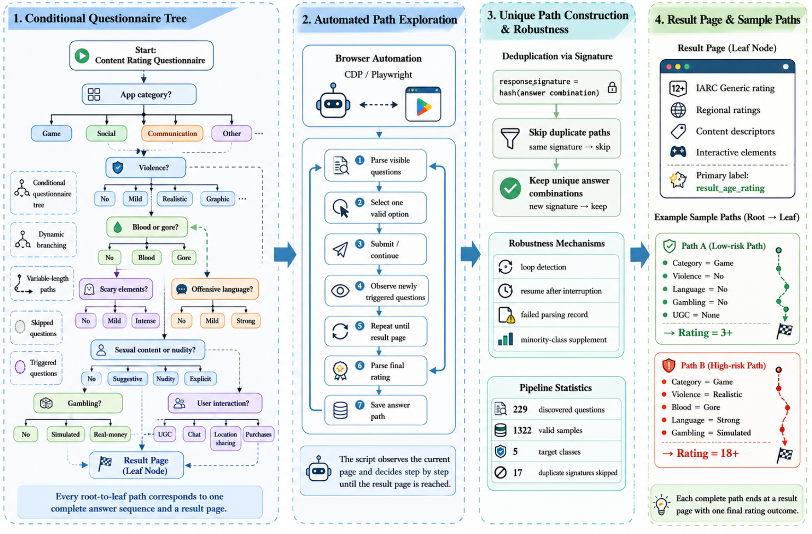{width=100%}

## Automated Collection for a Tree-Structured Questionnaire

The Google Play content rating questionnaire is not a fixed form. Later questions appear dynamically according to earlier answers. Therefore, the collection script must identify currently visible questions at each step, select valid answers, and advance the questionnaire.

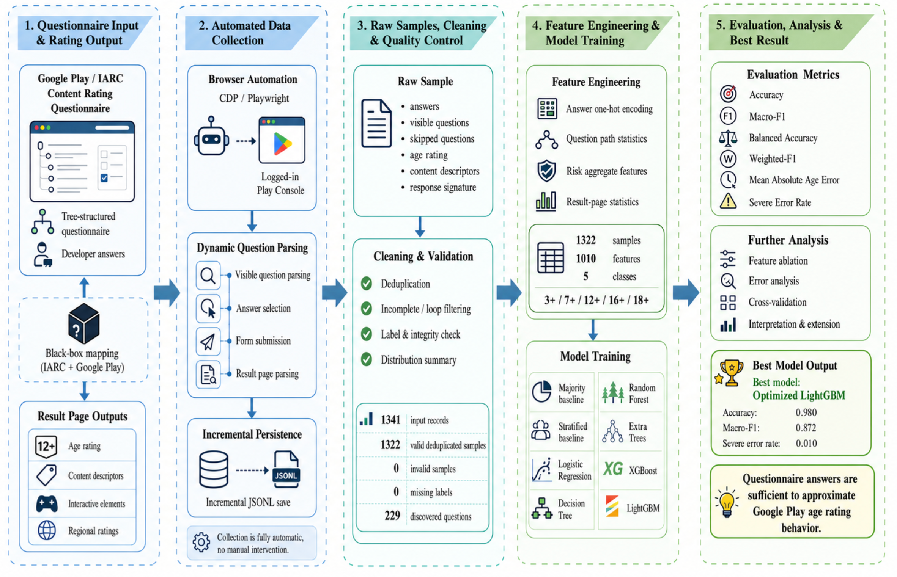{width=100%}

The project uses an automation workflow based on Chrome DevTools Protocol and Playwright. The scripts connect to an already logged-in browser instance, select questionnaire options, submit the questionnaire, parse the rating result page, and incrementally store samples as JSONL records.

The core collection loop is:

```python
for i in range(sample_count):
    page = connect_to_logged_in_chrome()
    answers = {}

    while questionnaire_can_continue(page):
        questions = parse_visible_questions(page)
        question = choose_next_question(questions)
        option = sample_option(question)
        select_option(page, question, option)
        answers[question.id] = option
        click_next_or_save(page)

    result = parse_rating_result(page)
    signature = hash_answers(answers)

    if signature not in seen_signatures:
        append_jsonl(answers, result, signature)
```

## Sampling and Deduplication Strategy

The collection strategy mainly relies on random path exploration, supplemented by minority-class sampling. Randomly selected questionnaire paths often trigger high-risk options, so the initial dataset contained a large proportion of 18+ samples. Later collection rounds therefore added low-risk and medium-risk path supplementation to improve the coverage of 3+, 7+, 12+, and 16+ samples.

The following mechanisms were used to maintain data quality during collection:

| Mechanism | Function |
|---|---|
| Random path exploration | Covers diverse paths in the tree-structured questionnaire |
| `response_signature` | Deduplicates identical answer combinations by hashing |
| Incremental JSONL writing | Reduces data loss when the browser crashes |
| Resume support | Allows collection to continue after interruption |
| Loop detection | Detects abnormal cyclic page states |
| Minority-class supplementation | Mitigates label imbalance |

At the implementation level, the collection system repeatedly performs four actions: state recognition, answer selection, questionnaire advancement, and result parsing. The script first connects to a logged-in browser and identifies the current questionnaire state. It then selects legal answers for visible questions, advances the page, and finally parses the result page into structured answers, ratings, and metadata.

# Dataset Construction and Statistical Analysis

## Data Organization

The final data is organized into three layers. The first layer stores raw questionnaire samples with complete answers and rating results. The second layer stores cleaned structured data for statistical analysis and label checking. The third layer stores the machine-learning feature matrix. This layered design preserves traceability while supporting downstream modeling and reproducibility.

The primary label field is:

```text
result_age_rating
```

It corresponds to the IARC Generic age rating.

## Dataset Size and Quality

The final dataset statistics are:

| Metric | Value |
|---|---:|
| Input records | `1341` |
| Successfully completed records | `1339` |
| Loop-detected records | `2` |
| Deduplicated skipped records | `17` |
| Valid deduplicated samples | `1322` |
| Invalid samples | `0` |
| Missing labels | `0` |
| Unique answer combinations | `1322` |
| Discovered questions | `229` |

The dataset exceeds the requirement of 1,000 valid samples. All final samples contain complete answers, rating labels, and parsed rating results.

## Label Distribution

The final label distribution is:

| Age rating | Samples | Ratio |
|---|---:|---:|
| `3+` | 37 | 2.8% |
| `7+` | 19 | 1.4% |
| `12+` | 225 | 17.0% |
| `16+` | 28 | 2.1% |
| `18+` | 1013 | 76.6% |

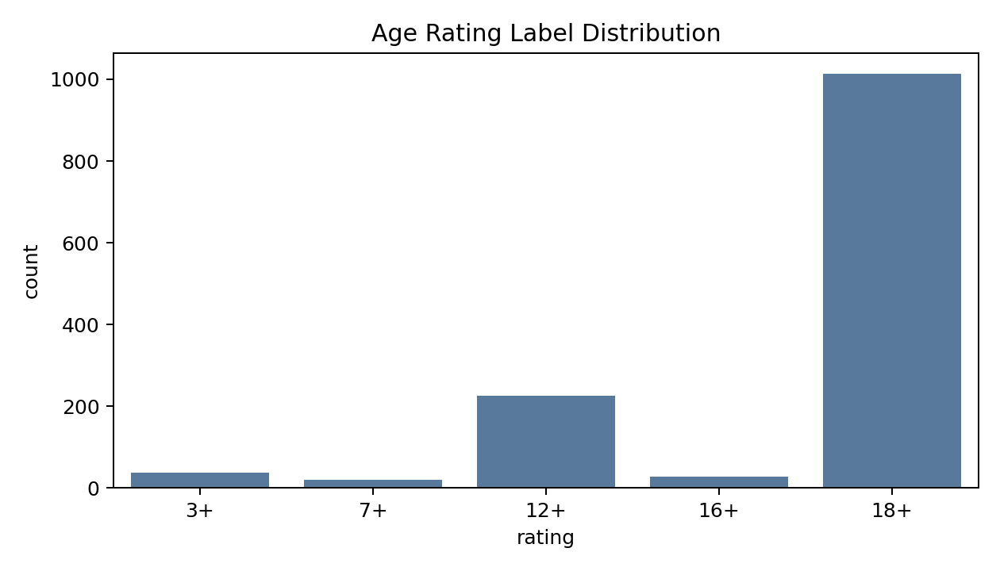{width=72%}

The dataset is clearly imbalanced. The 18+ class accounts for more than three quarters of all samples. A model that always predicts 18+ would still obtain high accuracy, so evaluation cannot rely on accuracy alone. Macro-F1, balanced accuracy, and severe error rate are therefore reported together.

## Data Quality Control

The experiment controls data quality through the following steps:

- Removing duplicate paths using answer signatures.
- Filtering incomplete questionnaires and loop-abnormal samples.
- Checking whether `result_age_rating` is missing.
- Preserving complete answer dictionaries for later inspection.
- Storing raw samples, processed data, and feature matrices in separate layers.

# Feature Engineering and Experimental Setup

## Questionnaire Answer Encoding

Each sample stores the complete questionnaire answers. For modeling, answers are expanded into one-hot features:

```text
answer__question_id_option = 0 or 1
```

This representation preserves both question identity and selected option, making it suitable for tree models, linear models, and feature importance analysis.

## Derived Statistical Features

In addition to answer features, the experiment constructs statistical and aggregate features:

| Feature | Meaning |
|---|---|
| `visible_question_count` | Number of questions shown along the path |
| `skipped_question_count` | Number of questions skipped due to conditional branching |
| `content_descriptor_count` | Number of content descriptors on the result page |
| `interactive_element_count` | Number of interactive elements on the result page |
| `violence_score`, etc. | Aggregate scores for risk themes |
| `high_risk_count` | Count of high-risk themes |
| `medium_risk_count` | Count of medium-risk themes |
| `triggered_branch_count` | Number of triggered questionnaire branches |

The final feature matrix size is:

```text
X shape = 1322 x 1010
feature matrix with label = 1322 x 1011
```

The extra column is the target label.

## Information Leakage Control

The project distinguishes two prediction settings:

| Setting | Feature scope | Purpose |
|---|---|---|
| Full-feature | Questionnaire answers + result-page statistical features | Strongest black-box surrogate and mechanism analysis |
| Answer-only | Questionnaire answers only | Closer to the pre-submission prediction scenario |

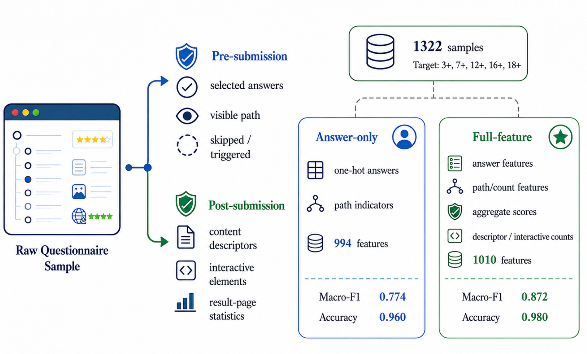{width=100%}

`content_descriptor_count` and `interactive_element_count` come from the result page, so they are not available before submission. Therefore, this report does not only present the full-feature model; it also evaluates an answer-only setting to measure the predictive power contained in questionnaire answers alone. This avoids mistaking post-hoc result-page information for pre-submission prediction ability.

In other words, the answer-only setting asks whether the rating can be predicted before submission using answers alone. The full-feature setting asks which structures in the complete input-output behavior correlate most strongly with ratings. These two settings address different questions and are interpreted separately.

## Experimental Settings and Metrics

The train-test split is:

| Setting | Value |
|---|---:|
| Random seed | `42` |
| Test ratio | `0.15` |
| Training set size | `1123` |
| Test set size | `199` |

The test-set class support is:

| Age rating | Test samples |
|---|---:|
| `3+` | 6 |
| `7+` | 3 |
| `12+` | 34 |
| `16+` | 4 |
| `18+` | 152 |

Because minority classes are small, the report uses multiple metrics:

- Accuracy
- Macro-F1
- Balanced accuracy
- Weighted-F1
- Mean absolute age error
- Severe error rate

Severe error is defined as a prediction whose age-level distance from the true label is at least two levels.

# Model Training and Performance Evaluation

## Model List

The experiment compares the following models:

| Model | Role |
|---|---|
| Majority baseline | Majority-class baseline |
| Stratified baseline | Random prediction according to label distribution |
| Logistic Regression | Interpretable linear model |
| Decision Tree | Rule-like approximation model |
| Random Forest | Tree ensemble |
| Extra Trees | Randomized tree ensemble |
| XGBoost | Gradient boosting tree model |
| LightGBM | Efficient gradient boosting tree model |

The core training procedure is:

```python
samples = load_valid_questionnaire_samples()
dataset = build_dataset(samples)
X, y = build_features(dataset, label="result_age_rating")

X_train, X_test, y_train, y_test = train_test_split(
    X, y, test_size=0.15, random_state=42, stratify=y
)

model.fit(X_train, y_train)
pred = model.predict(X_test)
metrics = evaluate_multiclass_rating(y_test, pred)
```

## Baseline Model Comparison

The first-round model comparison is:

\begin{center}
\scriptsize
\renewcommand{\arraystretch}{1.16}
\begin{tabularx}{\textwidth}{|>{\columncolor{zjutablefirst}}p{2.65cm}|Z|Z|Z|Z|Z|Z|}
\hline
\rowcolor{zjutablehead}\textbf{Model} & \textbf{Accuracy} & \textbf{Macro-F1} & \textbf{\makecell{Balanced\\Acc}} & \textbf{\makecell{Weighted\\F1}} & \textbf{MAE} & \textbf{\makecell{Severe\\Error}} \\
\hline
XGBoost & 0.970 & 0.833 & 0.777 & 0.965 & 0.065 & 0.015 \\
\hline
LightGBM & 0.975 & 0.824 & 0.783 & 0.971 & 0.050 & 0.010 \\
\hline
Extra Trees & 0.955 & 0.745 & 0.716 & 0.948 & 0.095 & 0.025 \\
\hline
Logistic Regression & 0.970 & 0.748 & 0.765 & 0.960 & 0.070 & 0.015 \\
\hline
Random Forest & 0.910 & 0.642 & 0.667 & 0.900 & 0.171 & 0.060 \\
\hline
Decision Tree & 0.915 & 0.608 & 0.642 & 0.908 & 0.166 & 0.065 \\
\hline
\end{tabularx}
\end{center}

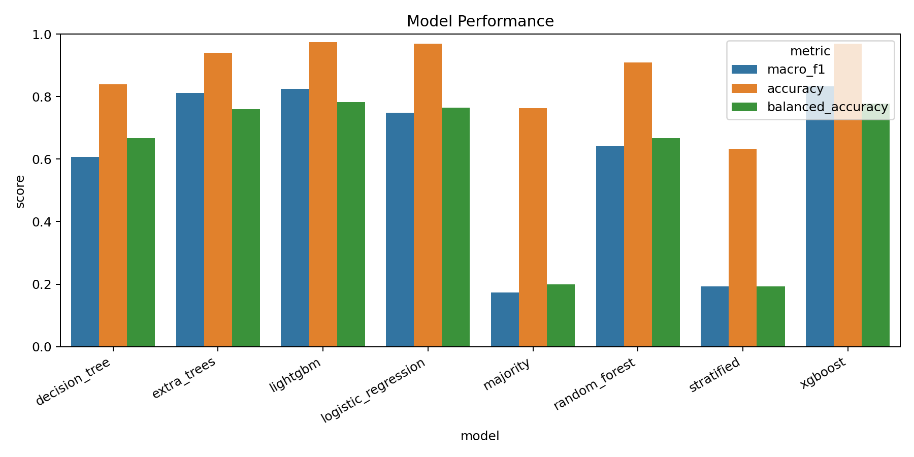{width=82%}

All formal models significantly outperform the baselines. In the first round, XGBoost achieved the highest macro-F1, while LightGBM achieved better accuracy and severe error rate.

## Optimized Model Results

After further hyperparameter tuning, optimized LightGBM became the best overall model:

| Model | Accuracy | Macro-F1 | Balanced Acc | Severe Error |
|---|---:|---:|---:|---:|
| Optimized LightGBM | 0.980 | 0.872 | 0.833 | 0.010 |
| Optimized XGBoost | 0.955 | 0.776 | 0.778 | 0.025 |
| Optimized Extra Trees | 0.955 | 0.745 | 0.716 | 0.025 |
| Optimized Logistic Regression | 0.965 | 0.745 | 0.764 | 0.020 |
| Optimized Decision Tree | 0.925 | 0.735 | 0.708 | 0.035 |
| Optimized Random Forest | 0.950 | 0.718 | 0.682 | 0.030 |

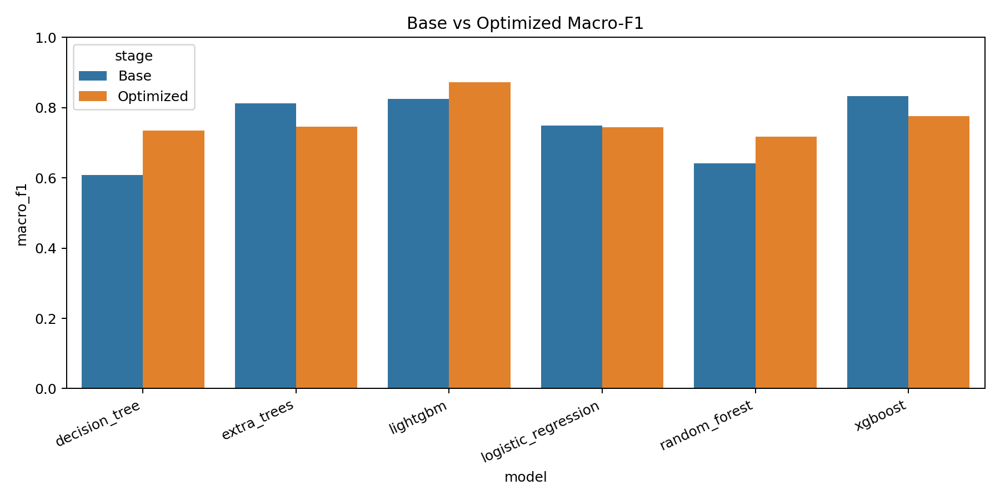{width=78%}

LightGBM's macro-F1 improved from 0.824 to 0.872 while maintaining the lowest severe error rate. This suggests that gradient boosting trees are well suited to the high-dimensional sparse questionnaire features in this experiment.

## Per-Class Performance of the Best Model

The per-class results of optimized LightGBM are:

| Class | Precision | Recall | F1 | Support |
|---|---:|---:|---:|---:|
| `3+` | 1.000 | 0.667 | 0.800 | 6 |
| `7+` | 1.000 | 1.000 | 1.000 | 3 |
| `12+` | 0.971 | 1.000 | 0.986 | 34 |
| `16+` | 1.000 | 0.500 | 0.667 | 4 |
| `18+` | 0.987 | 1.000 | 0.993 | 152 |

The model is stable on 12+ and 18+, while 16+ is the most difficult class. The main reason is that there are only 28 samples in the entire 16+ class and only 4 samples in the test set, so a few boundary samples can strongly affect this class's metric.

# Result Analysis and Black-Box Mechanism Interpretation

## Error Direction Analysis

Optimized LightGBM made only 4 errors among 199 test samples. The errors were mostly conservative overestimates, such as predicting 16+ as 18+. Notably, the model did not severely underestimate any 18+ sample as a lower-age class.

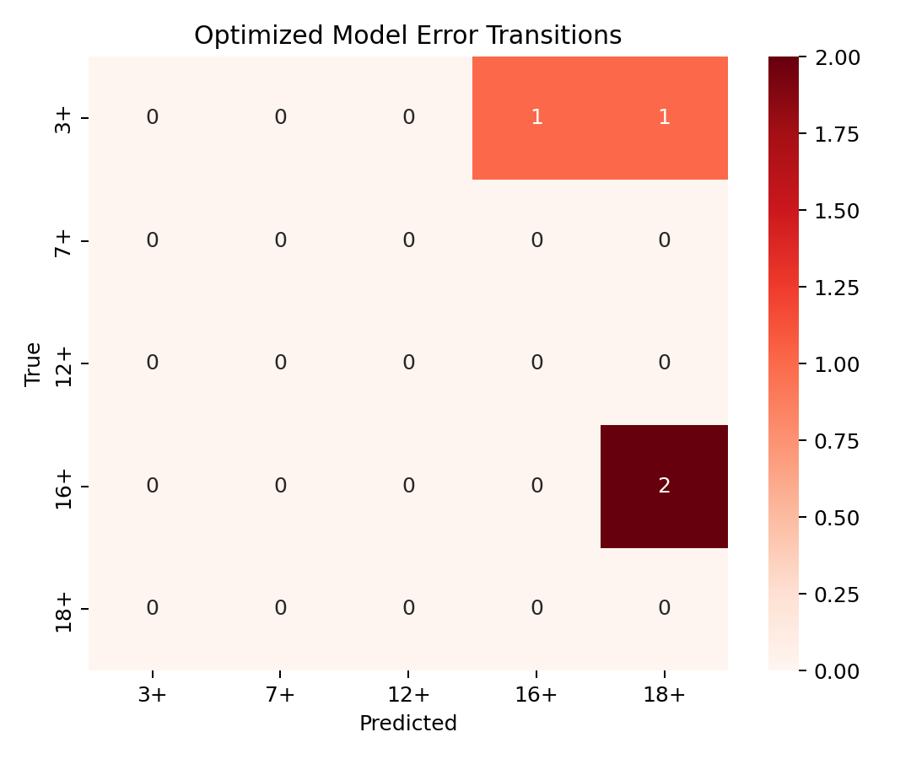{width=76%}

For age rating tasks, underestimating high-risk content is usually more serious. The current model's errors are more conservative, although overestimating low-risk applications may still affect app presentation and user perception.

## Feature Importance

Feature importance analysis shows that path length, interactive element count, content descriptor count, and several specific questionnaire answers have strong predictive effects.

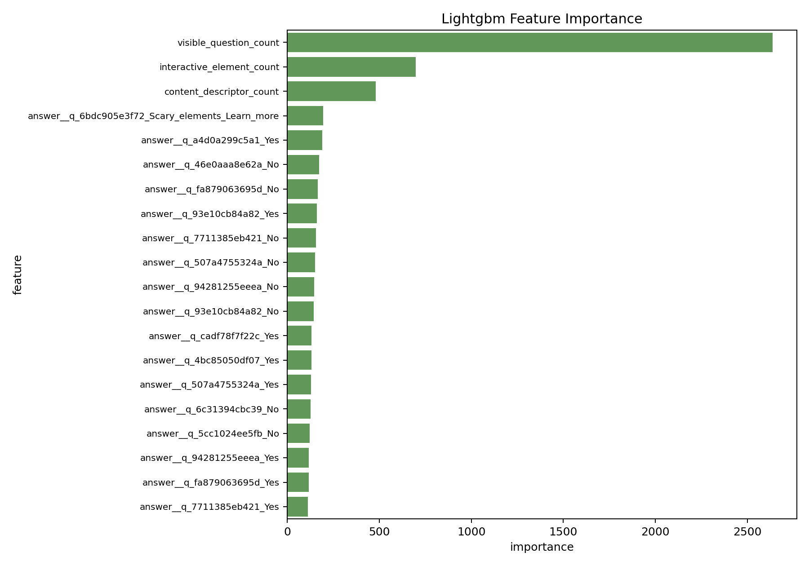{width=84%}

Some highly important features can be mapped back to questionnaire meanings:

| Feature meaning | Interpretation |
|---|---|
| Scary elements | Horror or frightening elements are strongly associated with rating changes |
| App category | App category affects subsequent questionnaire paths |
| Offensive language | Offensive language helps distinguish middle and high ratings |
| Age-restricted items | Age-restricted activities or goods are high-risk signals |
| Visible question count | Longer paths usually indicate more triggered risk branches |

This indicates that the model does not merely learn the label distribution. It captures structural relationships between questionnaire paths and content risk.

## Counterfactual Feature Flipping

The counterfactual experiment selected high-importance binary features from optimized LightGBM and flipped each feature from 0 to 1 or from 1 to 0, then observed whether the prediction changed.

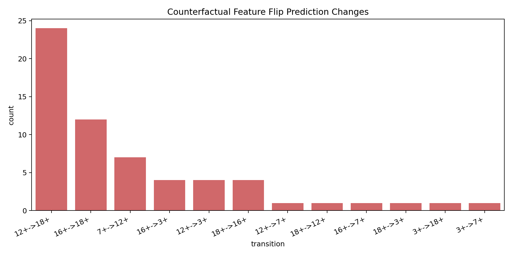{width=76%}

The experiment tested 25 high-importance features and found 62 samples whose predictions changed. The main transitions were:

| Prediction transition | Count |
|---|---:|
| `12+ -> 18+` | 24 |
| `16+ -> 18+` | 12 |
| `7+ -> 12+` | 7 |
| `18+ -> 16+` | 4 |
| `12+ -> 3+` | 4 |

This result shows that the model has clear local decision boundaries around several key features. However, single-feature flipping does not necessarily correspond to a valid real questionnaire path, so the result should be interpreted as model sensitivity rather than official rules.

## Black-Box Mechanism Findings

The combined modeling and interpretation results lead to five observations:

1. Questionnaire answers have strong predictive power for age ratings.
2. Triggering more questionnaire branches usually indicates more complex content risk.
3. Frightening elements, offensive language, and age-restricted activities are clearly related to rating changes.
4. The boundary between 16+ and 18+ is difficult and tends to produce conservative overestimation.
5. A black-box surrogate model can approximate observed input-output behavior, but it is not equivalent to the official decision logic.

# Supplementary Experiments and Extended Analysis

## Feature Ablation

To analyze the contribution of different feature groups, we performed feature ablation on optimized LightGBM:

\begin{center}
\scriptsize
\renewcommand{\arraystretch}{1.16}
\begin{tabularx}{\textwidth}{|>{\columncolor{zjutablefirst}}p{2.85cm}|Z|Z|Z|Z|Z|}
\hline
\rowcolor{zjutablehead}\textbf{Feature set} & \textbf{Features} & \textbf{Accuracy} & \textbf{Macro-F1} & \textbf{\makecell{Balanced\\Acc}} & \textbf{\makecell{Severe\\Error}} \\
\hline
Full & 1010 & 0.980 & 0.872 & 0.833 & 0.010 \\
\hline
No strategy & 1009 & 0.980 & 0.872 & 0.833 & 0.010 \\
\hline
No agg. scores & 999 & 0.980 & 0.872 & 0.833 & 0.010 \\
\hline
No desc./interact. & 1008 & 0.965 & 0.787 & 0.781 & 0.020 \\
\hline
Answer only & 994 & 0.960 & 0.774 & 0.811 & 0.025 \\
\hline
Counts/scores only & 15 & 0.693 & 0.417 & 0.500 & 0.191 \\
\hline
\end{tabularx}
\end{center}

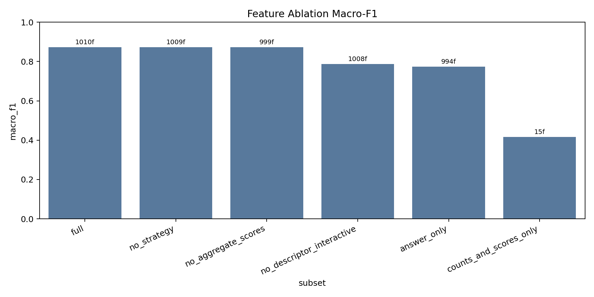{width=76%}

The ablation results show that specific questionnaire answers are the main signal source. Removing result-page descriptors and interactive elements reduces macro-F1 from 0.872 to 0.787. The answer-only model still reaches 0.774 macro-F1, showing that effective prediction is possible using pre-submission questionnaire answers alone.

## Cross-Validation Stability

To avoid relying too heavily on a single holdout split, we further performed 5-fold cross-validation:

\begin{center}
\scriptsize
\renewcommand{\arraystretch}{1.16}
\begin{tabularx}{\textwidth}{|>{\columncolor{zjutablefirst}}p{2.65cm}|Z|Z|Z|Z|}
\hline
\rowcolor{zjutablehead}\textbf{Model} & \textbf{\makecell{CV Macro-F1\\Mean}} & \textbf{\makecell{CV Macro-F1\\Std}} & \textbf{\makecell{Holdout\\Macro-F1}} & \textbf{\makecell{Holdout\\Severe Error}} \\
\hline
LightGBM & 0.741 & 0.076 & 0.872 & 0.010 \\
\hline
XGBoost & 0.704 & 0.066 & 0.776 & 0.025 \\
\hline
Decision Tree & 0.716 & 0.069 & 0.735 & 0.035 \\
\hline
Random Forest & 0.699 & 0.026 & 0.718 & 0.030 \\
\hline
\end{tabularx}
\end{center}

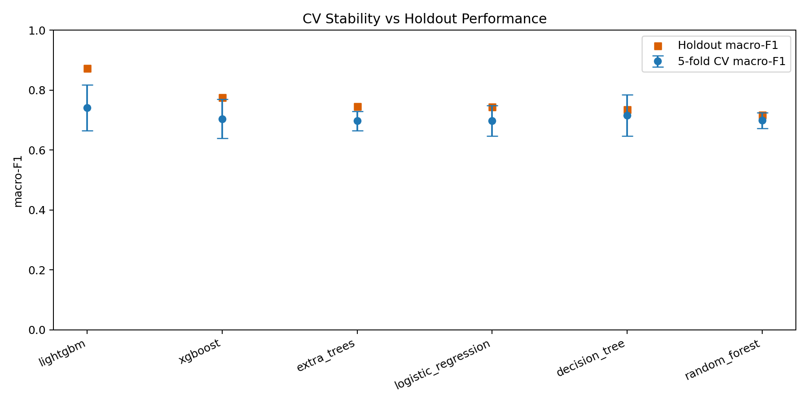{width=76%}

LightGBM performs best on the holdout test set, but its mean CV macro-F1 is lower than the holdout score. This suggests that the fixed test split may be optimistic and that minority-class scarcity still introduces performance fluctuation.

## Ordinal Classification and Confidence Analysis

Age ratings have a natural order:

```text
3+ < 7+ < 12+ < 16+ < 18+
```

We also converted the task into multiple threshold-based binary classification tasks. However, the ordinal model did not outperform the direct multiclass LightGBM:

| Model | Accuracy | Macro-F1 | Severe Error |
|---|---:|---:|---:|
| Optimized LightGBM | 0.980 | 0.872 | 0.010 |
| Ordinal LightGBM Thresholds | 0.945 | 0.748 | 0.030 |

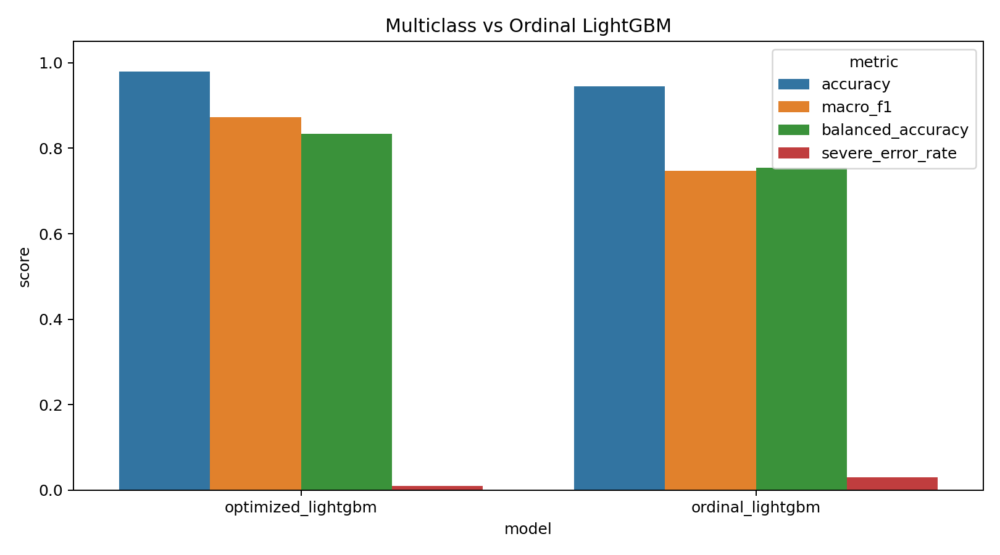{width=74%}

In addition, optimized LightGBM achieved 0.995 Top-2 accuracy, meaning that for boundary cases, the true label is usually among the model's top two candidates.

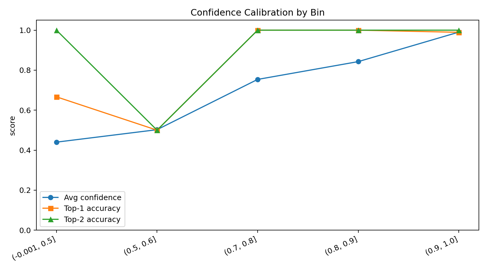{width=74%}

## Regional Rating Extension

In addition to the primary IARC Generic label, the result page includes labels from multiple regional rating authorities. We further trained LightGBM models to predict regional ratings, removing `result_age_rating` during training to avoid label leakage.

| Authority | Samples | Classes | Accuracy | Macro-F1 | Balanced Acc |
|---|---:|---:|---:|---:|---:|
| IARC Generic | 1322 | 5 | 0.975 | 0.829 | 0.767 |
| ESRB | 1322 | 5 | 0.884 | 0.822 | 0.807 |
| Google Play | 1322 | 6 | 0.960 | 0.811 | 0.787 |
| PEGI | 1322 | 6 | 0.960 | 0.748 | 0.744 |
| USK | 1322 | 5 | 0.970 | 0.738 | 0.749 |

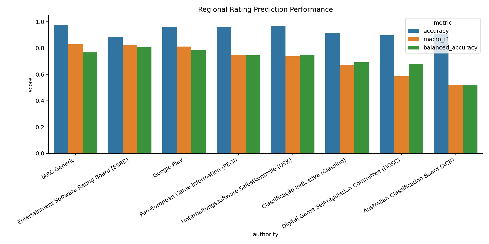{width=78%}

This extension shows that questionnaire answers can predict not only the primary label but also rating labels under different regional systems.

# Discussion and Conclusion

## Problems and Solutions

| Problem | Manifestation | Solution |
|---|---|---|
| Tree-structured questionnaire | Different paths show different questions | Automatically explore paths and record visible questions |
| Imbalanced random sampling | 18+ dominates the dataset | Supplement minority paths and use macro-F1 |
| Duplicate random paths | Identical answer combinations are collected | Deduplicate with `response_signature` |
| Complex result page | Regional rating fields are not uniform | Convert results into standardized JSONL and CSV |
| Leakage risk | Result-page statistics are post-hoc information | Separate full-feature and answer-only experiments |
| Unstable minority metrics | Few 7+ and 16+ test samples | Use CV and error analysis for interpretation |

## Limitations

The experiment still has several limitations:

1. The dataset is imbalanced, and 3+, 7+, and 16+ samples remain scarce.
2. The model is a black-box surrogate and can only approximate input-output behavior; it cannot prove the official rules.
3. Some statistical features come from the result page. Strict pre-submission prediction should prioritize answer-only results.
4. Minority-class holdout support is small, so per-class metrics fluctuate.
5. Collection is affected by the experimental account, app type, and questionnaire version; conclusions may change as the platform updates.

## Conclusion

This experiment completed a black-box reverse modeling study of the Google Play age rating questionnaire. Through automated path exploration, 1,322 real valid samples were collected. The tree-structured questionnaire answers were converted into a 1,010-dimensional feature matrix, and multiple machine-learning models were trained to predict IARC Generic age ratings.

Optimized LightGBM achieved the best overall performance, reaching 0.980 accuracy, 0.872 macro-F1, and 0.010 severe error rate on the holdout test set. Feature ablation shows that questionnaire answers are the main predictive signal. Error analysis shows that the model mainly makes conservative overestimates and does not severely underestimate 18+ samples. The regional rating extension further indicates that questionnaire features transfer to multiple rating systems.

Overall, the experiment demonstrates that even when Google Play's age-rating rules are not public, systematic sampling and machine learning can build a high-performing surrogate model. The model cannot replace the official rating mechanism, but it helps explain the relationship between questionnaire answers and final ratings and provides a reproducible data-driven method for studying black-box platform mechanisms.

\clearpage
\phantomsection
\section*{Appendices}
\addcontentsline{toc}{section}{Appendices}

\appendix

# Core Code and Scripts

## Automated Collection Module

The automated collection module generates real input-output samples from the Google Play content rating questionnaire. Its core task is not to submit a fixed form, but to dynamically identify visible questions and move along conditional branches.

- \path{scripts/probe_questionnaire_branches_cdp.py}: probes the questionnaire page structure and records currently visible questions and options from a logged-in browser page. This script is used to understand the dynamic form before large-scale sampling.
- \path{scripts/sample_questionnaire_paths_cdp.py}: randomly explores questionnaire paths under configurable sampling parameters. Its output is the raw path-level sample set used as the main evidence source.
- \path{scripts/sample_minority_paths_cdp.py}: supplements low-risk and medium-risk paths to improve minority-class coverage. It is used after the initial collection reveals strong 18+ dominance.
- \path{scripts/convert_cdp_samples.py}: converts raw CDP collection output into the standard JSONL sample format, making later validation, feature construction, and modeling independent of browser-specific logs.

The core collection loop is:

```python
while questionnaire_can_continue(page):
    visible_questions = parse_visible_questions(page)
    question = choose_next_unanswered_question(visible_questions)
    option = sample_valid_option(question)
    select_option(page, question, option)
    answers[question.id] = option
    click_next_or_save(page)

rating_result = parse_rating_result(page)
```

To avoid collecting the same answer combination repeatedly, each sample is assigned an answer signature:

```python
response_signature = hash_answer_combination(answers)

if response_signature in seen_signatures:
    skip_sample()
else:
    save_sample(answers, rating_result, response_signature)
```

This mechanism preserves unique questionnaire paths and improves sample diversity.

## Data Validation and Feature Construction Module

The data processing module converts raw collection results into modeling data and checks sample quality.

- \path{scripts/validate_dataset.py}: validates raw samples by checking sample status, missing labels, duplicate answer signatures, label distribution, and abnormal records.
- \path{scripts/build_dataset.py}: builds the processed dataset by expanding questionnaire answers, preserving the target label, and generating the model-ready feature matrix.

A key detail in data loading is:

```python
pd.read_csv(path, keep_default_na=False, na_values=[""])
```

This prevents the legal questionnaire string `"None"` from being incorrectly interpreted as a missing value.

During feature construction, questionnaire answers are expanded into one-hot features:

```python
answer_feature = f"answer__{question_id}_{selected_option}"
X[answer_feature] = 1
```

The system also preserves path statistics and risk aggregation features, including visible question count, skipped question count, content descriptor count, interactive element count, and risk-theme scores.

## Model Training and Optimization Module

The modeling module trains multiclass age-rating predictors and stores evaluation results. The base experiment compares multiple models, while the optimization experiment further tunes parameters and selects models using macro-F1, balanced accuracy, and severe error rate.

- \path{scripts/train_models.py}: trains baseline and standard models, including majority baseline, linear models, decision trees, and ensemble models.
- \path{scripts/optimize_models.py}: performs parameter tuning and model selection, with optimized LightGBM selected as the strongest overall model.

The training procedure is:

```python
X_train, X_test, y_train, y_test = train_test_split(
    X, y, test_size=0.15, random_state=42, stratify=y
)

model.fit(X_train, y_train)
pred = model.predict(X_test)
metrics = evaluate(y_test, pred)
```

The age-level order is:

```text
3+ -> 0
7+ -> 1
12+ -> 2
16+ -> 3
18+ -> 4
```

A severe error is defined as a prediction at least two levels away from the true label. This metric is more suitable than accuracy alone for age rating because it measures large cross-age misclassifications.

## Supplementary Analysis Module

The supplementary analysis module improves interpretability and persuasiveness.

- \path{scripts/run_feature_ablation.py}: measures the contribution of questionnaire answers, result-page statistics, aggregate scores, and count-only features.
- \path{scripts/run_advanced_experiments.py}: performs counterfactual flipping, Top-2 confidence analysis, and ordinal classification experiments to study model boundaries and label order.
- \path{scripts/train_region_rating_models.py}: trains regional rating predictors and tests whether questionnaire features transfer to different rating authority systems.

These analyses help the report answer not only which model performs best, but also why the model works, which features matter, whether the results are stable, and whether post-hoc features affect interpretation.

# Main Output Files

## Data Artifacts

\begin{center}
\scriptsize
\renewcommand{\arraystretch}{1.18}
\begin{tabularx}{\textwidth}{|>{\columncolor{zjutablefirst}}p{2.6cm}|p{5.3cm}|Y|}
\hline
\rowcolor{zjutablehead}\textbf{Artifact} & \textbf{File} & \textbf{Role} \\
\hline
Raw samples & \path{data/raw/real_20260615_full.samples.jsonl} & Complete questionnaire paths with answers, ratings, descriptors, interactive elements, and regional ratings. \\
\hline
Processed data & \path{data/processed/real_20260615_full.dataset.csv} & Tabular sample-level dataset for statistics, label checks, and manual inspection. \\
\hline
Feature matrix & \path{data/processed/real_20260615_full.features.csv} & Model input table built from questionnaire answers and derived features. \\
\hline
Question catalog & \path{data/questionnaire/real_question_catalog_20260615_full.json} & Question and option catalog used to interpret feature meanings. \\
\hline
\end{tabularx}
\end{center}

Together, these artifacts form the evidence chain from raw collection to model input.

## Metrics and Analysis Artifacts

\begin{center}
\scriptsize
\renewcommand{\arraystretch}{1.16}
\begin{tabularx}{\textwidth}{|>{\columncolor{zjutablefirst}}p{3.0cm}|p{6.0cm}|Y|}
\hline
\rowcolor{zjutablehead}\textbf{Metric artifact} & \textbf{File} & \textbf{Content} \\
\hline
Dataset validation & \path{outputs/analysis/current/metrics/dataset_validation_full.json} & Valid samples, missing labels, duplicates, and label distribution. \\
\hline
Base models & \path{outputs/analysis/current/metrics/model_metrics.json} & First-round multi-model comparison. \\
\hline
Optimized models & \path{outputs/analysis/current/metrics/optimized_model_metrics.json} & Tuned model metrics and best-model result. \\
\hline
Feature ablation & \path{outputs/analysis/current/metrics/feature_ablation_summary.csv} & Performance under different feature subsets. \\
\hline
Cross-validation & \path{outputs/analysis/current/metrics/optimized_cv_stability_summary.csv} & CV macro-F1, standard deviation, and holdout comparison. \\
\hline
Error analysis & \path{outputs/analysis/current/metrics/optimized_error_analysis_summary.json} & Error counts, directions, and severe errors. \\
\hline
Counterfactual & \path{outputs/analysis/current/metrics/counterfactual_summary.json} & Prediction changes after flipping high-importance features. \\
\hline
Regional rating & \path{outputs/analysis/current/metrics/region_rating_model_summary.csv} & Prediction performance for regional rating authorities. \\
\hline
\end{tabularx}
\end{center}

These metric files support the reported performance, stability, ablation, and extension conclusions.

## Key Figure Artifacts

\begin{center}
\scriptsize
\renewcommand{\arraystretch}{1.14}
\begin{tabularx}{\textwidth}{|>{\columncolor{zjutablefirst}}p{3.2cm}|p{6.1cm}|Y|}
\hline
\rowcolor{zjutablehead}\textbf{Figure} & \textbf{File} & \textbf{Purpose} \\
\hline
Label distribution & \path{outputs/analysis/current/figures/experiment_label_distribution.png} & Shows class imbalance. \\
\hline
Model comparison & \path{outputs/analysis/current/figures/model_performance.png} & Compares initial model performance. \\
\hline
Optimization gain & \path{outputs/analysis/current/figures/base_vs_optimized_macro_f1.png} & Shows macro-F1 improvement after tuning. \\
\hline
Error transitions & \path{outputs/analysis/current/figures/optimized_error_transitions.png} & Analyzes error directions. \\
\hline
Feature importance & \path{outputs/analysis/current/figures/lightgbm_feature_importance.png} & Explains influential features. \\
\hline
Counterfactual transitions & \path{outputs/analysis/current/figures/counterfactual_prediction_transitions.png} & Shows prediction changes after local feature flips. \\
\hline
Feature ablation & \path{outputs/analysis/current/figures/feature_ablation_macro_f1.png} & Demonstrates feature group contribution. \\
\hline
CV stability & \path{outputs/analysis/current/figures/cv_stability_macro_f1.png} & Shows cross-validation fluctuation. \\
\hline
Regional rating & \path{outputs/analysis/current/figures/region_rating_prediction_performance.png} & Shows performance across regional rating systems. \\
\hline
\end{tabularx}
\end{center}

## Process Screenshots

To avoid overloading the appendix with full-page screenshots, only three representative screenshots are included: questionnaire filling, conditional branch expansion, and result-page parsing. These screenshots are used as process evidence and do not expose passwords, cookies, or browser login state.

{width=84%}

The first process screenshot shows the actual content rating questionnaire interface. It includes single-choice, binary, and multi-part questions. The automated collector must identify currently visible questions, read candidate options, and record the answer combination for each sample.

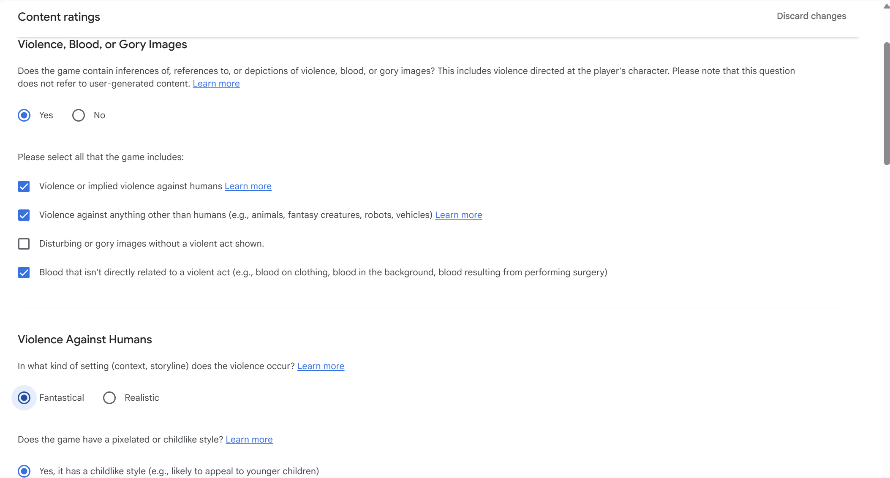{width=84%}

The second process screenshot shows how detailed follow-up questions appear after selecting a specific content topic. This demonstrates that the experiment deals with a conditional tree-structured questionnaire rather than a static table. Earlier answers affect whether later questions appear, so the sampling strategy must cover different paths instead of randomly filling fixed fields.

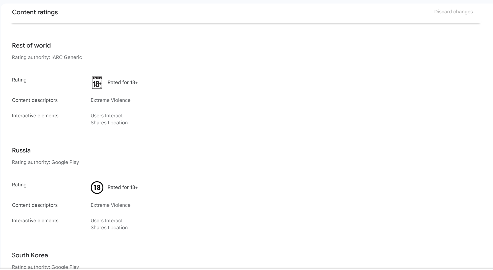{width=84%}

The third process screenshot shows the rating result page after questionnaire submission. The result page provides the IARC Generic rating, regional ratings, content descriptors, and interactive elements. The experiment parses these contents into structured labels and metadata for validation, training, and regional rating analysis.
