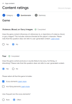
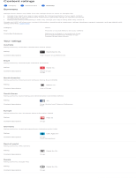
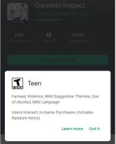

# Google Play 年龄分级问卷的黑盒逆向建模与预测

## 项目描述

Google Play 的年龄分级机制旨在帮助家长为未成年人选择合适的应用。在 Google Play 商店中，用户可以看到每个应用的年龄分级、内容描述符以及互动元素。这些分级结果是在开发者完成内容分级问卷后生成的。然而，整个分级过程对开发者和用户都是不透明的。Google 并未公开问卷的具体决策规则或逻辑，因此该过程可以被视为一个完整的黑盒系统。

本项目旨在使用数据驱动的方法对这一黑盒系统进行逆向建模。通过探索问卷答案与最终年龄分级之间的映射关系，本实验希望能够基于问卷回答准确预测应用的年龄分级结果。

### 图示

#### 步骤 1：内容分级问卷

#### 步骤 2：内容分级问卷结果页面

#### 步骤 3：Google Play 商店中的年龄分级展示

## 任务要求

### 1）数据采集策略设计与实现

- 针对树状结构的问卷，设计一种系统且高效的数据采集策略，并通过脚本实现自动化提交与数据收集。至少收集 1000 条有效样本，且样本应具有足够的多样性。
- Google Play Developer Console：https://play.google.com/console/developers（访问需要已注册的 Google Play 开发者账号。）

### 2）模型训练与预测

- 对采集到的数据进行特征工程，并训练用于年龄分级预测的多分类机器学习模型。至少尝试 3 种不同模型，并进行性能比较与优化。

### 3）结果分析

对实验结果进行全面分析，包括整体模型性能、不同年龄分级类别之间的差异、对 Google Play 分级机制潜在模式的探索（例如最具影响力的问题），以及整体结论。

### 4）实验报告

撰写一份完整报告，内容包括：数据采集策略和数据集分析、模型训练与性能评估、遇到的问题及解决方案、结果分析与主要发现。报告中必须包含数据集信息、核心代码以及关键结果图表。
